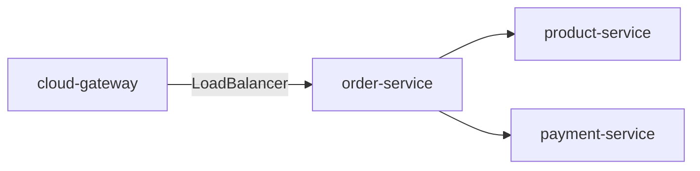

```mermaid
flowchart LR
    cloud-gateway --LoadBalancer--> order-service
    order-service --> product-service
    order-service --> payment-service
```

`cloud-gateway` 에 요청을 보내면, spring cloud gateway 가 라우팅하여 각 서비스에 요청을 보낸다.

